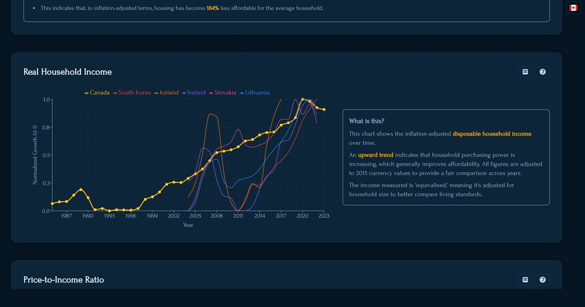

# Housing Affordability Dashboard

> An interactive data visualization tool for exploring and comparing housing affordability metrics across OECD countries.

This web application provides a deep dive into housing market trends, allowing users to compare key indicators like the price-to-income ratio, mortgage burden, and the time required to save for a down payment. It features interactive charts, country-wide comparisons, and powerful "Buy vs. Rent" simulation tools to help users understand the complex dynamics of housing affordability.

**[Visit the Live Demo](https://buying-house.pages.dev)**



---

## ✨ Key Features

-   **Interactive Data Visualization:** Historical trends for Real Household Income, Price-to-Income Ratios, Mortgage Burden, and more, presented with `Recharts`.
-   **Cross-Country Comparison:** A sortable and filterable table to compare affordability metrics across dozens of countries.
-   **Buy vs. Rent Simulators:**
    -   **Asset Performance:** Compares the net worth of a homeowner vs. a renter who invests their down payment and monthly savings.
    -   **Personal Outcome:** Simulates financial outcomes based on a user's specific income and savings rate.
-   **Advanced Financial Modeling:** Includes a sensitivity analysis chart to show how outcomes change based on stock market returns.
-   **Fully Responsive:** A mobile-first design that provides an optimal experience on desktops, tablets, and phones.
-   **Internationalization (i18n):** Supports multiple languages using `next-intl`.
-   **Theming:** A light/dark mode theme switcher.

## 🛠️ Technologies Used

-   **Framework:** [Next.js](https://nextjs.org/) (App Router)
-   **Language:** [TypeScript](https://www.typescriptlang.org/)
-   **Styling:** [Tailwind CSS](https://tailwindcss.com/)
-   **Charting:** [Recharts](https://recharts.org/)
-   **Animation:** [Framer Motion](https://www.framer.com/motion/)
-   **Internationalization:** [next-intl](https://next-intl-docs.vercel.app/)
-   **Deployment:** [Cloudflare Pages](https://pages.cloudflare.com/) via `@cloudflare/next-on-pages`.

## 📊 Data Source & Attribution

The primary data source for this project is the [**OECD (Organisation for Economic Co-operation and Development)**](https://data.oecd.org).

### Analytical House Prices Indicators
Provides Residential Property Price Indices (RPPIs) used to calculate real house prices, rental prices, and price-to-income ratios. (Last updated: Nov 13, 2025)

### Income Distribution Database (IDD)
Source for the "Equivalised Household Disposable Income" metric, offering data on income levels, inequality, and poverty. (Last updated: June 16, 2025)

### Financial Market Indicators
The long-term interest rate from this dataset is used as a consistent proxy for mortgage rates across all countries. (Last updated: Nov 10, 2025)

This application uses data retrieved from the OECD database. The OECD bears no responsibility for the analysis or interpretation of the data presented here. I tried to minimize the opinions in any text in the app but any errors are on me. For more information on data usage, please refer to the [OECD's Terms and Conditions](https://www.oecd.org/termsandconditions/).

The Python scripts located in the `/scripts` directory are used to fetch, clean, and process this data into a format suitable for the application.

## 🚀 Getting Started

To run this project locally, follow these steps.

### Prerequisites

-   [Node.js](https://nodejs.org/) (v20.x or later recommended)
-   [Python](https://www.python.org/) (v3.x for running data scripts)

### Installation

1.  **Clone the repository:**
    ```bash
    git clone https://github.com/JoseAlpineTech/buying-house
    cd buying-house
    ```

2.  **Install dependencies:**
    ```bash
    npm install
    ```

3.  **(Optional) Fetch the latest data:**
    If you wish to refresh the affordability data from the OECD, you'll need to set up the Python environment.
    ```bash
    # Navigate to the scripts directory
    cd scripts

    # It's recommended to use a virtual environment
    python -m venv venv
    source venv/bin/activate  # On Windows, use `venv\Scripts\activate`

    # Install Python dependencies
    pip install -r requirements.txt # Note: A requirements.txt would need to be created

    # Run the fetch script
    python 01_fetch_affordability_data.py
    ```

4.  **Run the development server:**
    ```bash
    npm run dev
    ```

The application will be available at `http://localhost:3000`.

## 📂 Project Structure

The codebase is organized with a focus on feature-based components and clear separation of concerns.

```
/
├── app/                  # Next.js App Router pages and layouts
├── components/           # Reusable React components
│   ├── charts/           # Specific chart components (Recharts)
│   ├── home/             # Components used only on the main page
│   └── ui/               # Generic UI elements (modals, cards, etc.)
├── data/                 # Static data and TypeScript definitions
├── lib/                  # Core logic, constants, and utility functions
├── messages/             # Internationalization (i18n) language files
├── public/               # Static assets (images, icons)
├── scripts/              # Data fetching and processing Python scripts
└── ...                   # Config files
```

## 📜 Available Scripts

-   `npm run dev`: Starts the Next.js development server.
-   `npm run build`: Creates a production-ready build of the application.
-   `npm run deploy:cf`: Builds the app and prepares it for deployment to Cloudflare Pages.
-   `npm run lint`: Runs ESLint to check for code quality and style issues.

## 📄 License

This project is licensed under the **MIT License**. This license is highly permissive and allows you to use, copy, modify, merge, publish, distribute, sublicense, and/or sell copies of the software for any purpose, commercial or private, with very few restrictions.

You can create a file named `LICENSE` in the root of your project and paste the following text into it:

## ✍️ Author

Created by **Jose Palacios** ([jose@alpinetech.ca](mailto:jose@alpinetech.ca))
- AI assistance from: Gemini 2.5 and GPT-5.1